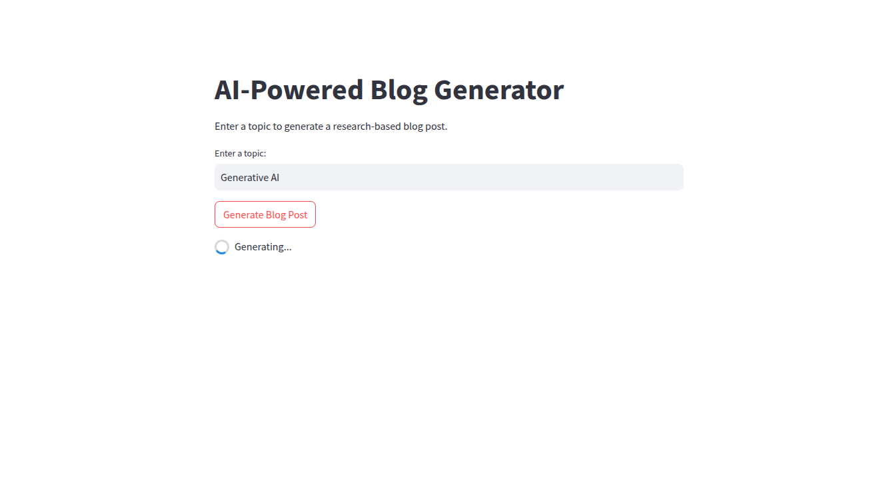
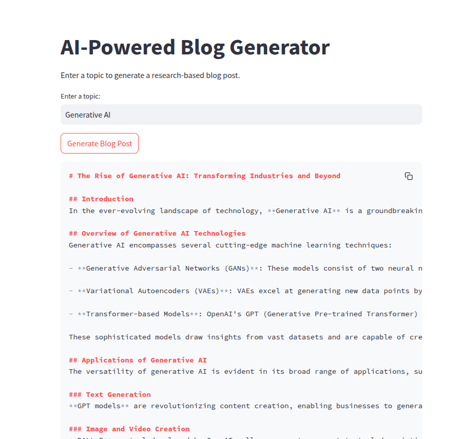

# AI-Powered Blog Generator

This project leverages **CrewAI** to generate research-based blog posts. It combines the power of AI agents for research and content writing to create engaging and accurate blog posts on any topic.

## Features

- **Research Agent**: Conducts comprehensive research on the given topic, evaluates credibility, and organizes findings into a structured report.
- **Content Writing Agent**: Transforms research findings into an engaging blog post while maintaining factual accuracy and readability.
- **Streamlit Frontend**: A user-friendly interface to input topics and view generated blog posts.
- **Flask Backend**: Handles API requests and integrates with CrewAI for task execution.

## Screenshots




### Key Files

- **`streamlit_app.py`**: Implements the Streamlit-based frontend for user interaction.
- **`flaskapp.py`**: Provides a Flask-based backend for API requests.
- **`test.py`**: Contains test cases and examples for CrewAI agents and tasks.
- **`templates/index.html`**: HTML template for the Flask frontend.
- **`.env`**: Stores API keys and environment variables.

## Installation

1. Clone the repository:
   ```bash
   git clone <repository-url>
   cd CrewAIProject
   ```
2. Install Dependencies:
   ```bash
   pip install -r requirements.txt
   ```

3. Add your API to the .env file:

## Usage

### Streamlit Frontend

1. Run the Streamlit app:
   ```bash
   streamlit run streamlit_app.py
   ```
2. Open the app in your browser at http://localhost:8501.

3. Enter a topic and click "Generate Blog Post" to see